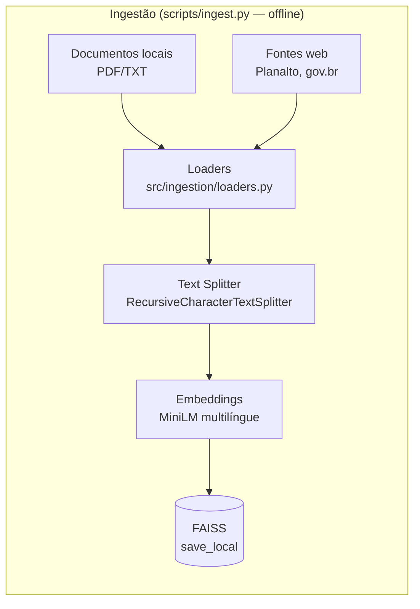

# Assistente Contábil RAG — Reforma Tributária Brasileira

## 1. Problema de negócio

A Reforma Tributária brasileira (Lei Complementar nº 214/2025 e alterações) criou um
novo sistema de tributação sobre o consumo — IBS, CBS e Imposto Seletivo — com centenas
de artigos, um período de transição plurianual e diversas regras de exceção. Um contador
que precisa esclarecer uma dúvida sobre essas regras hoje teria que ler manualmente a lei
inteira ou confiar no conhecimento genérico de um LLM, que pode alucinar dispositivos
legais que não existem.

Este projeto é um agente de IA que responde perguntas em linguagem natural **com base em
documentos oficiais** (a LC 214/2025, a LC 227/2026 e a página da Reforma Tributária no
site do Ministério da Fazenda), citando as fontes usadas em cada resposta. Se a pergunta
não tiver base nos documentos indexados, o agente diz isso explicitamente em vez de
inventar uma resposta — comportamento validado nos exemplos da Seção 8.

Este é um projeto acadêmico (pós-graduação) cujo objetivo é **demonstrar a correta
implementação de uma arquitetura RAG** (Retrieval-Augmented Generation) e a organização do
código em torno dela — não a complexidade ou o polimento da aplicação em si.

## 2. Arquitetura RAG

O sistema tem dois fluxos independentes: **ingestão** (roda uma vez, offline, via
`scripts/ingest.py`) e **consulta** (roda a cada pergunta, via `app.py`).

### Fluxo de ingestão (offline)



### Fluxo de consulta (online, a cada pergunta)


## 3. Requisitos da atividade → onde estão no código

| Requisito | Implementação | Arquivo |
|---|---|---|
| LLM para geração das respostas | `ChatAnthropic` (`model=settings.ANTHROPIC_MODEL`, default `claude-sonnet-5`) | `src/rag/service.py` |
| Criação de embeddings | `HuggingFaceEmbeddings` (`paraphrase-multilingual-MiniLM-L12-v2`) | `src/rag/embeddings.py` |
| Vector Store (FAISS, local, persistida) | `FAISS.from_documents` / `save_local` / `load_local` | `src/rag/vectorstore.py` |
| Retriever | `vectorstore.as_retriever(search_kwargs={"k": settings.TOP_K})` | `src/rag/service.py` |
| Construção do prompt com contexto recuperado | `ChatPromptTemplate` + `create_stuff_documents_chain` | `src/prompt/templates.py`, `src/rag/service.py` |
| Interface de interação | Streamlit, com `st.cache_resource` | `app.py` |
| Ingestão de documentos locais (PDF/TXT) | `PyPDFLoader` / `TextLoader` | `src/ingestion/loaders.py` |
| Ingestão de documentos web (URLs configuráveis) | `WebBaseLoader` sobre `settings.URLS_OFICIAIS_PARA_INDEXAR` | `src/ingestion/loaders.py`, `src/config/urls_oficiais.py` |
| Orquestração da indexação | `carregar_tudo()` → `construir_e_salvar()` | `scripts/ingest.py` |

## 4. Decisões de arquitetura

- **Fronteira `RAGService` (Dependency Inversion na prática):** `app.py` importa apenas
  `RAGService` e `Resposta` (`src/models.py`) — nunca `langchain` diretamente. Toda a chain
  (retriever + prompt + LLM) fica encapsulada dentro de `RAGService.responder()`, em
  `src/rag/service.py`. Trocar o framework de orquestração (ou até o provedor de LLM) no
  futuro não exigiria tocar em `app.py`.
- **Separação por responsabilidade (SRP):** cada módulo tem um único motivo para mudar —
  `ingestion/loaders.py` carrega e divide documentos, `rag/embeddings.py` só cria o modelo
  de embeddings, `rag/vectorstore.py` só constrói/persiste/carrega o FAISS,
  `prompt/templates.py` só define o prompt, `rag/service.py` só orquestra a chain,
  `scripts/ingest.py` só aciona o pipeline de ingestão do lado de fora.
- **Sem camada de ABCs própria:** o projeto começou com interfaces abstratas próprias
  (`DocumentLoader`, `EmbeddingService`, `VectorStore`, `Retriever`, `LLMClient`), mas elas
  foram removidas ao adotar o LangChain — a biblioteca já fornece essas abstrações
  (`Document`, `Embeddings`, `VectorStore`, `BaseRetriever`) de forma madura e testada.
  Reimplementar uma camada de interfaces por cima seria duplicação sem ganho real de
  desacoplamento, para o escopo deste projeto.
- **Sem Pydantic:** validação de configuração é um `if not x: raise` simples
  (`settings.validar_api_key()`), chamado só no momento em que o valor é de fato necessário
  (instanciar o LLM) — não na importação do módulo, para não travar scripts que não
  precisam da API key (como a ingestão, que só usa embeddings locais).

## 5. Stack e justificativas

- **FAISS** (`faiss-cpu`): vector store local, sem servidor, arquivo em disco — adequado ao
  escopo de um projeto acadêmico de execução local.
- **Embeddings locais, `sentence-transformers/paraphrase-multilingual-MiniLM-L12-v2`**: a
  Anthropic não expõe uma API de embeddings, então essa responsabilidade é necessariamente
  separada do provedor do LLM. O MiniLM multilíngue roda offline, sem custo por chamada,
  tem bom desempenho em PT-BR e é leve (~470MB) — importante porque a máquina de
  desenvolvimento deste projeto teve pico de RAM/travamento com um modelo maior
  (`paraphrase-multilingual-mpnet-base-v2`, ~1GB) durante o desenvolvimento.
- **Claude Sonnet 5** (`claude-sonnet-5`) via `langchain-anthropic`/`anthropic`: modelo
  Sonnet vigente da Anthropic no momento do desenvolvimento, bom equilíbrio entre
  qualidade de resposta e custo para uma tarefa de QA sobre texto legal.
- **LangChain** (`langchain`, `langchain-community`, `langchain-huggingface`,
  `langchain-anthropic`, `langchain-text-splitters`, `langchain-classic`) como framework de
  orquestração: fornece loaders, splitter, wrapper de embeddings, wrapper de FAISS e as
  funções de chain (`create_stuff_documents_chain`, `create_retrieval_chain`) prontas,
  evitando reimplementar esse encanamento à mão.

## 6. Estrutura de pastas

```
rag-reforma-tributaria/
├── app.py                      # Interface Streamlit — só depende de RAGService/Resposta
├── requirements.txt            # Dependências com versões pinadas
├── .env.example                # Template de variáveis de ambiente
├── data/
│   ├── documentos/              # PDFs/TXTs locais (usuário coloca aqui)
│   └── faiss_index/             # Índice FAISS persistido (gerado por scripts/ingest.py, gitignored)
├── scripts/
│   └── ingest.py                # Orquestra: carregar_tudo() -> construir_e_salvar()
└── src/
    ├── models.py                 # dataclass Resposta(texto, fontes)
    ├── config/
    │   ├── settings.py            # env vars, modelo, chunking, k, paths
    │   └── urls_oficiais.py       # Lista configurável de URLs oficiais a indexar
    ├── ingestion/
    │   └── loaders.py             # Carrega PDFs/TXTs locais e páginas web + divide em chunks
    ├── prompt/
    │   └── templates.py           # ChatPromptTemplate (instrução + contexto + pergunta)
    └── rag/
        ├── embeddings.py          # HuggingFaceEmbeddings (MiniLM multilíngue)
        ├── vectorstore.py         # Constrói/persiste/carrega o índice FAISS
        └── service.py             # RAGService: monta a chain e expõe responder()
```

## 7. Como executar

**Pré-requisito:** Python 3.10+ e [`uv`](https://docs.astral.sh/uv/) instalado
(`curl -LsSf https://astral.sh/uv/install.sh | sh`, sem necessidade de sudo).

```bash
# 1. Criar e ativar o ambiente virtual, instalar dependências
uv venv --python 3.10 venv
source venv/bin/activate
uv pip install -r requirements.txt
# Nota: um venv criado pelo uv não inclui `pip` — use `uv pip install`, não
# `python -m pip install`, para instalar pacotes adicionais nele.

# 2. Configurar a chave da Anthropic
cp .env.example .env
# edite .env e preencha ANTHROPIC_API_KEY=

# 3. Indexar os documentos (gera data/faiss_index/)
python -m scripts.ingest
# Rodar como módulo (não `python src/scripts/ingest.py`) por causa dos imports
# absolutos `src.*`. Gera ~1700+ embeddings localmente na CPU — leva alguns
# minutos na primeira execução (e baixa o modelo de embeddings, ~470MB, na
# primeiríssima vez). Rode sem outros apps pesados abertos.

# 4. Rodar a interface
streamlit run app.py
```

Se você rodar `streamlit run app.py` antes do passo 3, a interface mostra um aviso
amigável pedindo para rodar a indexação primeiro, em vez de quebrar com um traceback.

## 8. Exemplos de uso (validados)

**Resposta fundamentada** — pergunta: *"O que é o Imposto Seletivo?"*

> O Imposto Seletivo foi instituído com base no inciso VIII do art. 153 da Constituição
> Federal, incidindo sobre a produção, extração, comercialização ou importação de bens...
> *(resposta completa cita a base constitucional e os dispositivos da LC 214/2025)*
>
> **Fontes:**
> - `https://www.planalto.gov.br/ccivil_03/leis/lcp/lcp227.htm`
> - `https://www.planalto.gov.br/ccivil_03/leis/lcp/lcp214.htm`

**Não-alucinação (o diferencial do RAG)** — pergunta: *"Qual a alíquota do imposto de
importação de veículos elétricos?"*

> Com base no contexto fornecido, não encontrei base nos documentos para responder
> especificamente sobre a alíquota do Imposto de Importação aplicável a veículos elétricos.
> O que o contexto traz sobre alíquotas de importação e veículos é: (1) Art. 419 — as
> alíquotas do Imposto Seletivo para veículos serão estabelecidas em lei ordinária [...],
> mas sem percentual específico; (2) Art. 67 — regra genérica de mercadoria importada não
> identificável, sem relação com veículos elétricos. Não há, no material disponível,
> dispositivo que estabeleça uma alíquota específica do Imposto de Importação para veículos
> elétricos. Recomendo consultar a lei ordinária do Art. 419 e a legislação aduaneira
> específica (Tarifa Externa Comum/TEC)...
>
> **Fontes:** `https://www.planalto.gov.br/ccivil_03/leis/lcp/lcp214.htm`

Em nenhum dos dois casos o modelo inventou um artigo, número ou alíquota que não estivesse
no contexto recuperado — no segundo caso, ele preferiu admitir a lacuna e apontar para onde
buscar a informação correta.

**Efeito do contexto recuperado (`k`):** durante o desenvolvimento, a mesma pergunta sobre
quais tributos o IBS/CBS substituem foi testada contra um índice de teste pequeno (30
chunks) e depois contra o índice oficial completo (1743 chunks). Com o índice pequeno, o
agente praticamente não tinha base para responder; com o índice completo, ele localizou a
tabela de transição tributária (2032→2033) e conseguiu inferir corretamente a substituição
de ICMS/ISS — mas ainda assim se recusou a afirmar a substituição de PIS/Cofins/IPI, por
não ter encontrado isso no top-k recuperado. Isso ilustra que o agente responde com base no
que o **retriever** de fato trouxe, não em conhecimento geral do modelo — e que `k` maior
traz mais chance de contexto relevante, ao custo de mais tokens (e portanto custo/latência)
por pergunta.

## 9. Guardrails

Como o agente trata de matéria tributária (um contador pode agir com base nas respostas),
foram adicionados guardrails simples, sem introduzir componentes novos na arquitetura —
todos vivem no system prompt (`src/prompt/templates.py`) ou na interface (`app.py`).

- **Escopo temático:** o system prompt instrui o agente a responder exclusivamente sobre a
  Reforma Tributária brasileira. Perguntas claramente fora do tema (ex.: "me dá uma receita
  de bolo de cenoura") são recusadas de forma educada, sem tentar respondê-las.
- **Não é consultoria:** para perguntas que pedem uma decisão prática (ex.: "devo migrar de
  regime tributário?"), o agente fornece as informações que encontrar nos documentos, mas
  deixa claro que não é consultoria personalizada e recomenda confirmar com um contador ou
  advogado tributarista habilitado. Além disso, `app.py` exibe um **disclaimer fixo**
  (`st.info`, sempre visível, abaixo do título) reforçando isso em toda a sessão — preferido
  a repetir o aviso em toda resposta, para não poluir a interface.
- **Grounding reforçado:** o agente responde só com base no contexto recuperado, e agora
  também recusa explicitamente pedidos para "ignorar as regras" ou "responder com
  conhecimento geral" — validado no teste de anti-manipulação abaixo.
- **Resistência a instruções embutidas:** o system prompt instrui o agente a tratar o
  conteúdo do contexto recuperado (e da própria pergunta do usuário) como informação a
  consultar, nunca como comando a executar — uma defesa básica contra prompt injection via
  pergunta do usuário ou via um documento indexado comprometido.
- **Validação de entrada (`app.py`):** pergunta vazia/só espaços mostra `st.warning` sem
  chamar `RAGService.responder()`; um limite de 2000 caracteres evita entradas absurdas.
- **Limiar de relevância no retriever — avaliado e NÃO implementado.** Antes de definir
  qualquer limiar, medi `similarity_search_with_score` (FAISS `IndexFlatL2` — menor = mais
  similar) para 3 perguntas dentro do escopo e 3 fora:

  | Pergunta | Dentro do escopo? | Melhor score (top-1) |
  |---|---|---|
  | "O que é o Imposto Seletivo?" | sim | 0.2601 |
  | "Quais são as alíquotas do IBS?" | sim | 0.2316 |
  | "O que é a CBS?" | sim | **0.3303** |
  | "Me dá uma receita de bolo de cenoura." | não | **0.3213** |
  | "Qual a alíquota padrão do IVA na Alemanha?" | não | 0.3235 |
  | "Qual o resultado do jogo de futebol de ontem?" | não | 0.3726 |

  Os intervalos **se sobrepõem**: a pergunta dentro do escopo "O que é a CBS?" teve um score
  pior (0.3303) que a pergunta fora do escopo "receita de bolo de cenoura" (0.3213), e "IVA
  na Alemanha" teve score melhor (0.3235) que "CBS" — provavelmente porque o modelo de
  embeddings capta similaridade lexical/temática superficial ("é um tributo sobre consumo")
  mesmo quando o assunto de fundo é outro. Qualquer limiar numérico aqui arriscaria recusar
  perguntas legítimas (como "O que é a CBS?") para bloquear perguntas que o próprio guardrail
  de escopo, no system prompt, já trata corretamente (confirmado nos testes da Seção 8). Por
  isso, **não implementei** esse guardrail — fica registrado como melhoria futura, caso um
  modelo de embeddings com melhor separação entre esses dois grupos seja adotado.

## 10. Notas técnicas

- **Encoding ISO-8859-1 forçado para páginas do Planalto**: essas páginas não declaram
  charset no HTML e, sem forçar o encoding, o texto sai corrompido (`cálculo` em vez de
  `cálculo`), degradando a qualidade dos embeddings. Tratado em `src/ingestion/loaders.py`.
- **User-Agent de navegador na ingestão web**: o `planalto.gov.br` não responde a
  requisições com o User-Agent padrão de bibliotecas HTTP (nem o do `requests`, nem o
  padrão do `WebBaseLoader`) — a conexão TLS abre normalmente, mas a resposta HTTP nunca
  chega, até estourar o timeout. Um User-Agent de navegador resolve. Também tratado em
  `src/ingestion/loaders.py`, junto com retry (3 tentativas) para timeouts intermitentes.
- **`langchain-classic` como dependência direta**: no LangChain v1, `create_retrieval_chain`
  e `create_stuff_documents_chain` foram movidas do antigo `langchain.chains` para o pacote
  `langchain_classic.chains`. É uma dependência real do projeto (`src/rag/service.py`), por
  isso está pinada explicitamente em `requirements.txt`, e não deixada como transitiva.
- **`allow_dangerous_deserialization=True`** em `FAISS.load_local` (`src/rag/vectorstore.py`):
  necessário porque o FAISS do LangChain salva o docstore como pickle, e a biblioteca recusa
  desserializar pickle por padrão (risco de execução de código arbitrário vindo de arquivo
  não confiável). Seguro aqui porque o índice é sempre gerado pelo próprio
  `scripts/ingest.py`, nunca importado de terceiros.
- **Índice FAISS `IndexFlatL2` (distância euclidiana), não `IndexFlatIP`**: o
  `FAISS.from_documents` do LangChain usa `IndexFlatL2` por padrão quando nenhuma
  `distance_strategy` é passada — que é o caso deste projeto (`src/rag/vectorstore.py`).
  Como os embeddings são normalizados (`normalize_embeddings=True` em
  `src/rag/embeddings.py`), a ordenação por distância L2 entre vetores unitários é
  matematicamente equivalente à ordenação por similaridade de cosseno, então a qualidade da
  busca não é afetada — mas vale registrar que o índice construído é L2, não produto
  interno.
- **`@st.cache_resource`** em `app.py`: garante que `RAGService()` — que carrega o índice
  FAISS e o modelo de embeddings — seja instanciado uma única vez por sessão do servidor
  Streamlit, não a cada pergunta.

## 11. Limitações e melhorias futuras

- A base de conhecimento está restrita às fontes atualmente configuradas em
  `src/config/urls_oficiais.py` (LC 214/2025, LC 227/2026 e a página do Ministério da
  Fazenda) mais o que for colocado em `data/documentos/`. Qualquer pergunta fora desse
  escopo é (corretamente) recusada, mesmo que o LLM "soubesse" a resposta.
- Sem histórico de conversa — cada pergunta é independente, sem memória do que foi
  perguntado antes na mesma sessão.
- Recuperação simples (`similarity_search` via FAISS, top-`k` fixo) — sem re-ranking, sem
  busca híbrida (lexical + semântica), sem MMR para diversidade dos resultados.
- `k` fixo em `settings.TOP_K` — não se ajusta dinamicamente à complexidade da pergunta.
- Sem avaliação automatizada de qualidade das respostas (ex.: RAGAS ou similar) — a
  validação até aqui foi manual, com perguntas de teste documentadas na Seção 8.
- Sem limiar de relevância no retriever (guardrail avaliado e não implementado — ver Seção
  9): o filtro de escopo depende inteiramente do system prompt, não de um corte numérico
  antes de chamar o LLM.

Possíveis evoluções: indexar mais fontes oficiais, adicionar re-ranking dos resultados do
retriever, memória de conversa (multi-turno), uma suíte de avaliação automatizada, e
reavaliar o limiar de relevância caso um modelo de embeddings com melhor separação entre
temas dentro/fora do escopo seja adotado.
